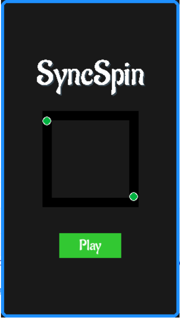

# **SyncSpin 🎮**

**SyncSpin** е игра каде играчот управува со топчиња кои се движат по одредена патека, се избегнуваат препреки и се собираат поени. Играта содржи 20 нивоа со различни патеки на движење.

## 🚀 Како се игра?

- Кликни со глувчето за да се смени правецот на движење на топчињата.
- Избегнувај ги препреките и собирај поени.
- За секое успешно ниво добиваш право да одиш понатаму.
- Имаш ограничен број животи во секој левел.

## 📦 Преземи го проектот

Кликни на следниот линк за да го преземеш целиот проект како `.zip` архива:

👉 [Download SyncSpin](https://github.com/aleksandra926/SyncSpin_Project/archive/refs/heads/master.zip)

---

## 🛠️ Технички детали

- **Јазик:** Python 3.11
- **Библиотеки:** Pygame

## 📸 Слика од играта

	

---

## 👩‍💻 Автор

Aleksandra Krstevska
